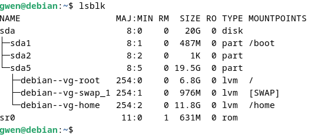
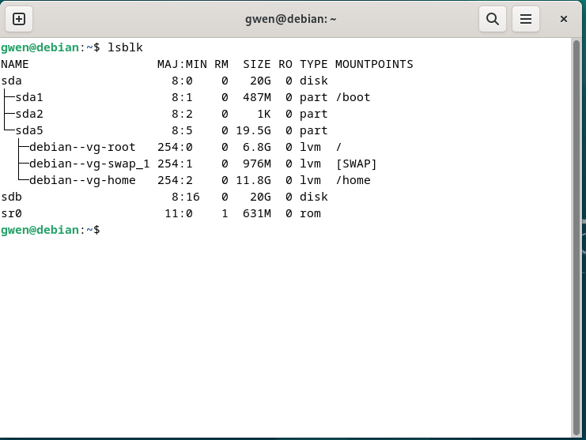
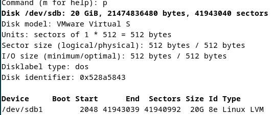
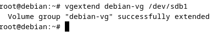
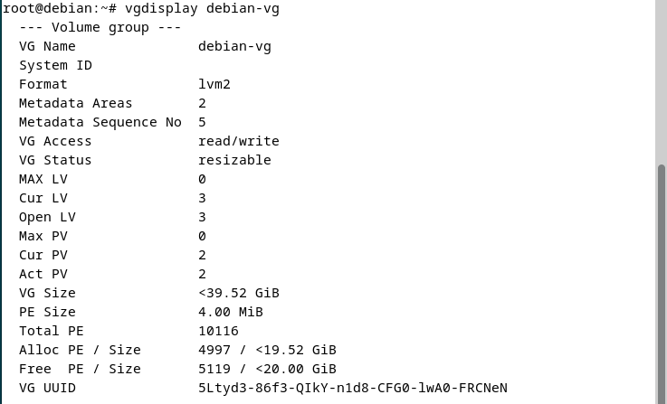
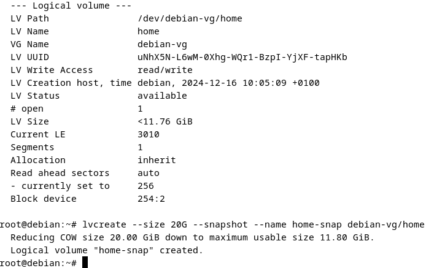
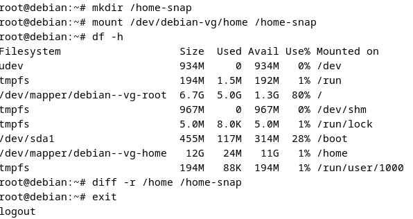
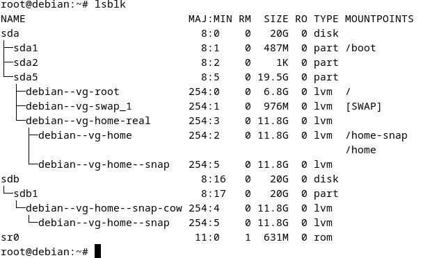
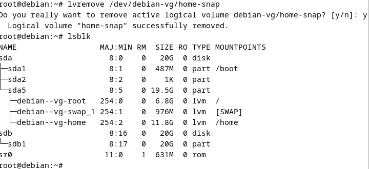

## QUETE LVM

## Installation initiale LVM sur Debian.  

  

## Ajout d'un disk sdb.  

  

## Formatage du disk en partition LVM.  

  

## Création du volume physique.  

  

## Ajout du nouveau volume au volume vg-debian.  

  

## Affichage du résultat (le volume totale est passé de 20G à 40G).  

  

## Création d'un snamp de /home.  

  

## Montage du snamp sur /home-snap.    

  

## Résultat du montage.    

  

## Bye bye snap !  

  

